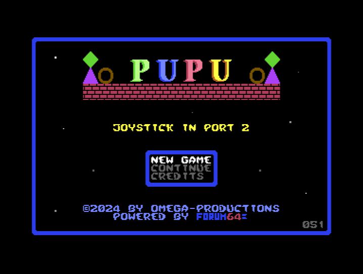
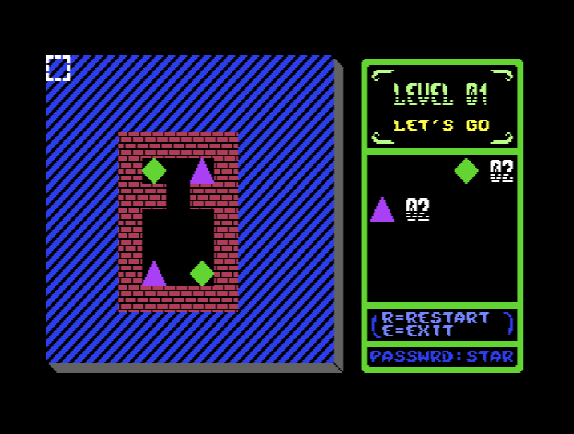
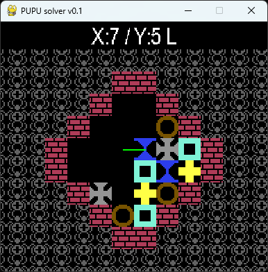

PUPU-Solver
===========
Mit diesem Programm kann man Level von [PUPU](http://sorceress.bplaced.net/tsb.htm) lösen lassen.


## PUPU

Ziel des Spiels ist es, durch links oder rechts bewegen von Steinen, alle Steine vom Spielbrett zu entfernen.

Sobald ein Stein in der Luft schwebt, fällt er hinab. Sind 2 oder 3 gleiche Steine neben- oder übereinander, so
verschwinden sie. Dies können 2 oder mehr Steine sein. Das Schwierige daran ist nun, dass man nicht irgendwann nur noch
1 Stein von einer Sorte übrig hat, da man diesen wegen fehlendem Partner nicht mehr entfernen kann.

## Der Solver

### Einleitung

Manchmal weiß man einfach nicht mehr weiter. In diesem Fall kann PUPU-Solver helfen. Das Programm benötigt das Level
als Textdatei in dem Format, wie es im Handbuch des Leveleditors beschrieben ist. Jede Steinvariante ist einem Zeichen
zugewiesen. Jede Zeile entspricht einer Zeile im Spiel.

Eine Datei kann z.B. so aussehen:
```
PPPPPPP
P#..1#P
P#R2R#P
P#1R##P
PPPPPPP
```
PUPU-Solver kann auch Rätsel lösen, die nicht der Größe 12x12 von PUPU entsprechen.

Es kann auch direkt eine SEQ-Datei von Pupu übergeben werden. Diese kann z.B. mit
[DirMaster](https://style64.org/dirmaster) extrahiert werden. Dabei ist zwingend notwendig, dass der <u>Levelname auch
in Anführungszeichen</u> steht! 

### Das Programmfenster

In der Defaulteinstellung wird das Fenster mit 5-facher Vergrößerung dargestellt und alle möglichen Varianten
durchprobiert. Dann wird die Lösung mit den wenigsten Zügen herausgesucht und präsentiert. Bei einem sehr komplizierten
Rätsel kann die Suche eine Weile dauern. Deshalb ist es ist auch möglich, mit dem Parameter `-f` die erste gefundene
Lösung anzuzeigen. Diese ist dann natürlich nicht optimiert. Man kann die Suche auch mit `ESC` abbrechen, dann wird aus
den bereits gefundenen Lösungsmöglichkeiten, die effektivste herausgesucht und präsenteiert.

Das Programm verschiebt jeden Stein nach links und rechts (soweit möglich) und speichert den daraus resultierenden
Zustand, falls er nicht schon mal vorhanden war, für die weitere Verarbeitung in eine Warteschlange. Das läuft so
lange, bis das Level gewonnen oder verloren ist (von einer Variante nur noch 1 Stein übrig ist). Ist es gewonnen,
werden die benötigten Züge gespeichert. Zum Schluss wird die Lösung herausgesucht, die die wenigsten Züge benötit.  

Im Debugmodus wird jeder Schritt dargestellt, im Normalmodus nur jeder 10.000ste. Der Debugmodus ist natürlich
wesentlich langsamer. Es wird das aktuell berechnete Bild und oberhalb 3 Informationen dargestellt. Der erste Wert
gibt die <span style="color:lightgreen;background-color:black">Anzahl der bereits gefundenen möglichen Lösungen</span>
an, der zweite Wert gibt die <span style="color:green;background-color:black">Anzahl der noch weiter zu untersuchenden
Bildschirme</span> in der Warteschlange an, die dritte Zahl, <span style="color:orange;background-color:black">wieviele
unterschiedliche Bildschirme schon abgearbeitet wurden</span>.


Am Ende wird der gefundene Lösungsweg angezeigt. Außerdem wird die Lösung in eine Datei `.sol` geschrieben, die später
mit dem Parameter `-s` wieder geladen werden kann, ohne die gesamte Berechnung wieder durchführen zu müssen.



Oberhalb der Grafik wird der nächste Zug in der Form `X:pos`/`Y:pos` `Richtung` angezeigt. Dabei gbt `pos`die Position
des zu bewegenden Steines an und `Richtung` die Richtung, in welche er bewegt werden muss. Außerdem wird das mit einer
grünen Linie in der Grafik dargestellt.

### Bedienung

Mit den Cursortasten `<-` und `->` kann man in der Lösung vor- und zurückblättern. Außerdem lässt sich das Programm
jederzeit mit `ESC` beenden.

Wurde ein Rätsel gelöst, wird die Lösung automatisch unter dem gleichen Dateinamen wie das Puzzle, nur mit der
Dateiendung `.sol` gespeichert. Diese Lösung kann später mit dem Parameter `-s` wieder geladen und angezeigt werden,
was die Zeit dür eine erneute Berechnung erspart. 

### Kommandozeilenparameter

```
usage: pupu_solver.py [-h] [-z FACTOR] [-s FILE] [-d] [-f] puzzle

Solver for PUPU-puzzles v0.3.1. Written by 64erGrufti in Nov. 2024.
The file has to be in the level editor format:
PPPPPPP
P#..2#P
P#.2R#P
P#.R##P
PPPPPPP

With tiles:
.: Empty      H: Heart    D: Diamond
T: Triangle   R: Ring     1: Cross#1
S: Sandglass  2: Cross#2  F: Frame
G: Glass      #: Wall     P: Pattern

or a SEQ-file from the PUPU-disk

Navigate with cursor right and left through the solution. ESC to exit

positional arguments:
  puzzle      Textfile with puzzle

options:
  -h, --help  show this help message and exit
  -z FACTOR   Set zoom factor (default: 5)
  -s FILE     Display already calculated solution
  -d          debug
  -f          Show the first found solution
              (otherwise the shortest of all possible solutions is shown)```
